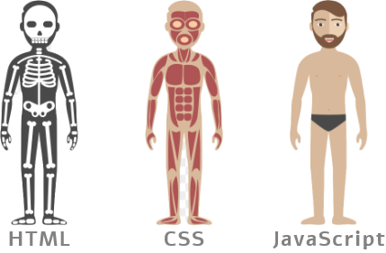
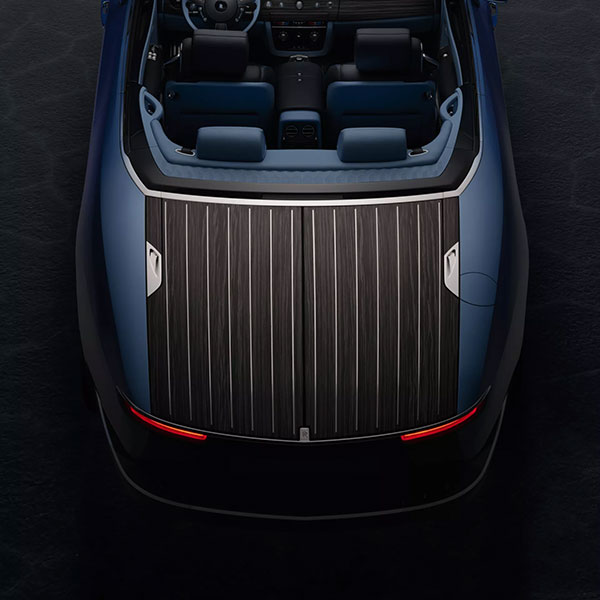
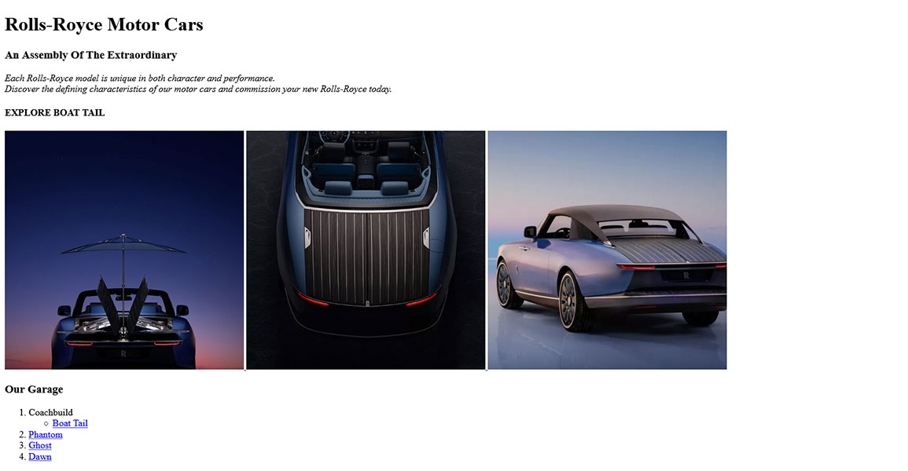

# Web Development Introduction
<p align="center">
  
</p>

## **HTML**
HTML stands for HyperText Markup Language. It is used for creating Web pages. HTML describes the structure of a Web page.  
HTML & CSS are not Programing languages. We are now using generation 5 of HTML (HTML5).  
  
### Some main tags

`<!DOCTYPE html>` Declaration defines that this document is an HTML5 document  
`<html>` Element is the root element of an HTML page  
`<head>` Element contains meta information about the HTML page  
`<title>` Element specifies a title for the HTML page  
`<body>` Element defines the document's body  
`<h1>....<h6>` Element defines a large heading  
`<p>` Element defines a paragraph  
An HTML element is defined by a start tag, some content, and an end tag (though not all tags have a closing tag [eg. `<hr>` Defines horizontal rule])  
Example of an element in HTML would look something like `<p>Hello Welcome</p>`  

### A basic HTML page
[*basic-webpage.html*](basic-webpage.html)

```
<!DOCTYPE html>
<html>

<head>
    <title>Basic Webpage</title>
</head>

<body>

    <h1>Web Development Introduction</h1>
    <p>This is a very basic webpage</p>

</body>

</html>

```
  
<p align="center">
  
</p>  

### Some more important tags
`` Defines an image  
`<a>` Defines a hyperlink  
`<div>` Defines a section in a document  
`<blockquote>` Defines a section that is quoted from another source  
`<br>` Defines a single line break  
`<article>`  Defines an article  
`<header> | <footer>` Defines a header | footer for a document or section  
`<ol> | <ul>` Defines ordered | unordered list  
`<span>` Defines a section in a document  
`<table>` Defines a table  
[Read more](https://www.w3schools.com/TAGS/default.ASP)

For this tutorial I am going to make a mock webpage for [Rolls-Royce Motor Cars](https://www.rolls-roycemotorcars.com/en_GB/home.html)  
[*no-css.html*](no-css.html)

```
<!DOCTYPE html>
<html>

<head>
    <title>Rolls Royce Motor Cars</title>
</head>

<body>

    <!-- This is not at all aesthetically pleasing or a responsive webpage-->

    <h1><b>Rolls Royce Motor Cars</b></h1>
    <hr>
    <div class="section-heading">
        <h3>An Assembly Of The Extraordinary</h3>
    </div>
    <div class="characteristics-text">
        <p>
            Each Rolls-Royce model is unique in both character and performance.
            Discover the defining characteristics of our motor cars and commission your new Rolls-Royce today.
        </p>
    </div>
    <div class="section-heading">
        <h3>Explore Boat Tail</h3>
    </div>
    <div class="image-gallery">
        <span id="image1">
            <a href="https://www.rolls-roycemotorcars.com/en_GB/bespoke/discover.html">
                
            </a>
            <p>DISCOVER BESPOKE</p>
        </span>
        <span id="image2">
            <a href="https://www.rolls-roycemotorcars.com/en_GB/inspiring-greatness/objects/coachbuild-boat-tail.html">
                
            </a>
            <p>DISCOVER BOAT TAIL</p>
        </span>
        <span id="image3">
            <a href="https://www.rolls-roycemotorcars.com/en_GB/bespoke/coachbuild.html">
                
            </a>
            <p>DISCOVER COACHBUILD</p>
        </span>
    </div>
    <div class="section-heading">
        <h3>Other Models</h3>
    </div>
    <ol>
        <li>Bespoke</li>
        <ul>
            <li><a href="https://www.rolls-roycemotorcars.com/en_GB/inspiring-greatness/visionaries/the-making-of-boat-tail.html"
                    target="_blank">Boat Tail</a></li>
        </ul>
        <li><a href="https://www.rolls-roycemotorcars.com/en_GB/showroom/ghost.html">Ghost</a></li>
        <li><a href="https://www.rolls-roycemotorcars.com/en_GB/showroom/dawn.html">Dawn</a></li>
        <li><a href="https://www.rolls-roycemotorcars.com/en_GB/showroom/wraith.html">Wraith</a></li>
    </ol>

</body>

</html>
```

  

## **CSS**
CSS (Cascading Style Sheets) is the code that styles web content. There is Inline CSS, Internal CSS and External CSS. You can write CSS once and reuse the same sheet in multiple HTML pages.  
Inline CSS  
```
<h1 style="color: red"> Hello world! </h1>
```
Internal CSS  
```
<head>  
    <style>  
        h1 {  
            color: blue;  
        }  
    </style>  
</head>
```
External CSS  
```
<head>  
    <link rel="stylesheet" href="style.css">  
</head>
```
*style.css*
```
h1 {  
   color: red;  
}

```
When we add some fonts and link (External CSS) to the above HTML document, here it is called    
[*index.html*](index.html)

```
<head>
    <title>Rolls Royce Motor Cars</title>
    <!-- Google Fonts -->
    <link rel="preconnect" href="https://fonts.gstatic.com">
    <link
        href="https://fonts.googleapis.com/css2?family=Cormorant+Garamond:ital,wght@0,400;1,300;1,400&family=Josefin+Sans&family=Quicksand:wght@300;400&display=swap"
        rel="stylesheet">
    <!-- Linking CSS Style Sheet -->
    <link rel="stylesheet" href="css/main.css">
    <link rel="stylesheet" href="css/responsive.css">
</head>
```

The styles for the webpage are written in  
[*main.css*](css/main.css)

```
body {
    background-image: /* filter  */
    linear-gradient(rgba(173, 173, 173, 0.637), rgba(51, 51, 50, 0.5)), url('../img/bg.jpg');
    background-repeat: no-repeat;
    /* Fit the width*/
    background-size: cover;
    /* Always fix the image on screen*/
    background-attachment: fixed;
    margin-left: 10%;
    margin-right: 10%;
}

h1 {
    font-family: 'Josefin Sans';
    font-weight: 300;
    color: black;
    text-align: center;
}

hr {
    border-top: 1px solid black;
    margin-bottom: 30px;
}

.section-heading h3 {
    font-family: 'Josefin Sans';
    font-weight: 400;
    color: black;
}

.characteristics-text p {
    font-family: 'Cormorant Garamond';
    font-weight: 400;
    padding-left: 1em;
    text-align: center;
}

.image-gallery {
    text-align: center;
}

.image-gallery span {
    display: inline-block;
}

.image-gallery img {
    margin-left: 1.5em;
    margin-right: 1.5em;
    height: 350px;
    border-radius: 4px;
}

.image-gallery p {
    font-family: 'Quicksand';
    color: white;
    text-transform: capitalize;
}

ol {
    font-family: 'Cormorant Garamond';
    font-weight: 400;
    color: black;
}

a {
    text-decoration: underline;
    color: black;
}

a:hover {
    color: rgb(201, 201, 201);
}
```

Then the webpage is made somewhat responsive by defining the font size and image sizes inside  
[*responsive.css*](css/responsive.css)
```
@media only screen and (min-width: 768px) {
    h1 {
        font-size: 5em;
    }
    .section-heading h3 {
        font-size: 3.2em;
    }
    .characteristics-text p {
        font-size: 3em;
    }
    .image-gallery img {
        height: 600px;
        width: 600px;
    }
    .image-gallery p {
        font-size: 2em;
    }
    ol {
        font-size: 3em;
    }
}

@media only screen and (min-width: 992px) {
    h1 {
        font-size: 3em;
    }
    .section-heading h3 {
        font-size: 2em;
    }
    .characteristics-text p {
        font-size: 1.8em;
    }
    .image-gallery img {
        height: 350px;
        width: 350px;
    }
    .image-gallery p {
        font-size: 1.2em;
    }
    ol {
        font-size: 1.8em;
    }
}
```
Here [*responsive.css*](css/responsive.css) contains codes for only desktop and mobile devices. More can be found [here](https://www.w3schools.com/css/css_rwd_mediaqueries.asp).  
The final webpage would look something like this  
  

All respective images is attributed to their respective owners.  
[](https://www.rolls-roycemotorcars.com/en_GB/home.html) 