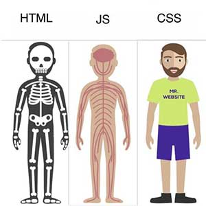
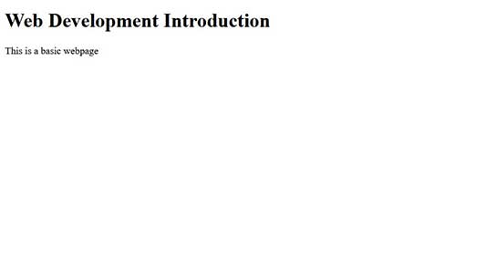

# Web-Development-Introduction
## HTML
HTML stands for HyperText Markup Language. It is used for creating Web pages. HTML describes the structure of a Web page.  
HTML & CSS are not Programing languages. We are now using generation 5 of HTML (HTML5).  
  
  
### Some main tags

`<!DOCTYPE html>` Declaration defines that this document is an HTML5 document  
`<html>` Element is the root element of an HTML page  
`<head>` Element contains meta information about the HTML page  
`<title>` Element specifies a title for the HTML page  
`<body>` Element defines the document's body  
`<h1>....<h6>` Element defines a large heading  
`<p>` Element defines a paragraph  
An HTML element is defined by a start tag, some content, and an end tag (though not all tags have a closing tag [eg. `<hr>` Defines horizontal rule])  
eg `<p>Hello Welcome</p>`  

### A basic HTML page
```
<!DOCTYPE html>
<html>

<head>
    <title>Basic Webpage</title>
</head>

<body>

    <h1>Web Development Introduction</h1>
    <p>This is a basic webpage</p>

</body>

</html>
```

  

### Some more tags
`` Defines an image  
`<a>` Defines a hyperlink  
`<div>` Defines a section in a document  
`<blockquote>` Defines a section that is quoted from another source  
`<br>` Defines a single line break  
`<article>`  Defines an article  
`<header> | <footer>` Defines a header | footer for a document or section  
`<ol> | <ul>` Defines ordered | unordered list  
`<span>` Defines a section in a document  
`<table>` Defines a table  
[Read more](https://www.w3schools.com/TAGS/default.ASP)


