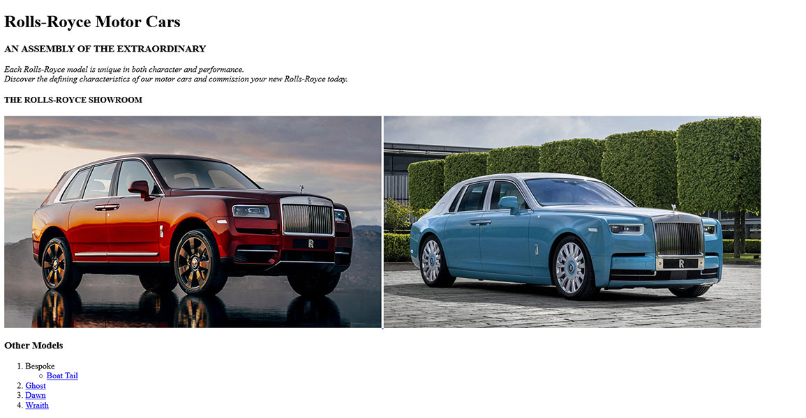

# Web-Development-Introduction
  

## HTML
HTML stands for HyperText Markup Language. It is used for creating Web pages. HTML describes the structure of a Web page.  
HTML & CSS are not Programing languages. We are now using generation 5 of HTML (HTML5).  
  
### Some main tags

`<!DOCTYPE html>` Declaration defines that this document is an HTML5 document  
`<html>` Element is the root element of an HTML page  
`<head>` Element contains meta information about the HTML page  
`<title>` Element specifies a title for the HTML page  
`<body>` Element defines the document's body  
`<h1>....<h6>` Element defines a large heading  
`<p>` Element defines a paragraph  
An HTML element is defined by a start tag, some content, and an end tag (though not all tags have a closing tag [eg. `<hr>` Defines horizontal rule])  
Example of an element in HTML would look something like `<p>Hello Welcome</p>`  

### A basic HTML page
*basic-webpage.html*
```
<!DOCTYPE html>
<html>

<head>
    <title>Basic Webpage</title>
</head>

<body>

    <h1>Web Development Introduction</h1>
    <p>This is a basic webpage</p>

</body>

</html>
```

  

### Some more important tags
`` Defines an image  
`<a>` Defines a hyperlink  
`<div>` Defines a section in a document  
`<blockquote>` Defines a section that is quoted from another source  
`<br>` Defines a single line break  
`<article>`  Defines an article  
`<header> | <footer>` Defines a header | footer for a document or section  
`<ol> | <ul>` Defines ordered | unordered list  
`<span>` Defines a section in a document  
`<table>` Defines a table  
[Read more](https://www.w3schools.com/TAGS/default.ASP)

For this tutorial I am going to make a webpage for [Rolls-Royce Motor Cars](https://www.rolls-roycemotorcars.com/en_GB/home.html)  
*index.html*
```
<!DOCTYPE html>
<html>

<head>
    <title>Rolls-Royce Motor Cars</title>
</head>

<body>
    
    <!-- Do note this is not a responsive webpage -->

    <h1><b>Rolls-Royce Motor Cars</b></h1>
    <h3>AN ASSEMBLY OF THE EXTRAORDINARY</h3>
    <p>
        <i>
            Each Rolls-Royce model is unique in both character and performance.<br>
            Discover the defining characteristics of our motor cars and commission your new Rolls-Royce today.
        </i>
    </p>
    <h4>THE ROLLS-ROYCE SHOWROOM</h4>
    <a href="https://www.rolls-roycemotorcars.com/en_GB/showroom/cullinan.html">
        
    </a>
    <a href="https://www.rolls-roycemotorcars.com/en_GB/showroom/phantom.html">
        
    </a>
    <h3>Other Models</h3>
    <ol>
        <li>Bespoke</li>
        <ul>
            <li><a href="https://www.rolls-roycemotorcars.com/en_GB/inspiring-greatness/visionaries/the-making-of-boat-tail.html"
                    target="_blank">Boat Tail</a></li>
        </ul>
        <li><a href="https://www.rolls-roycemotorcars.com/en_GB/showroom/ghost.html">Ghost</a></li>
        <li><a href="https://www.rolls-roycemotorcars.com/en_GB/showroom/dawn.html">Dawn</a></li>
        <li><a href="https://www.rolls-roycemotorcars.com/en_GB/showroom/wraith.html">Wraith</a></li>
    </ol>

</body>

</html>
```

  


